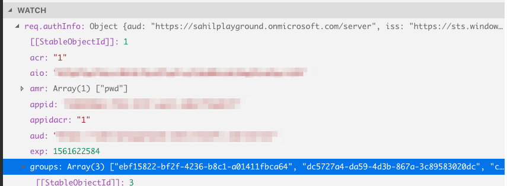

# Sample demonstrating Authorization in Azure AD using Groups

This code example demonstrates how to perform groups based authorization using NodeJS.
There are two components here.

1. The Client Web App that the user logs into, the user belongs to one or more groups
2. The Server API app that exposes a simple REST API protected by Azure AD. A call to the `/admin` URL has the ability to allow or deny the request based on the presence of groups the user is in.

## Setup

### Server API App
Register an application Azure AD with the following characteristics.

1. Redirect URI of `http://localhost:5000`
2. Under expose an API, create an application ID URI of `https://<tenantname>.onmicrosoft.com/server`
3. Add a scope called `default` make this an admin scope.

Update serverAPIApp\server.js with values from the client Web App registration

### Client Web App
Register an application in Azure AD with the following characteristics.

1. Redirect URI of `http://localhost:3000/auth/openid/return`
2. Generate a client secret, note down the value.
3. Allow implicit grant, access token and id token.

Update clientWebApp\config.js with values from the client Web App registration

### Setup permissions

1. Under the server API App go to the *expose an api* section and add a client application. Using the client id of the client web app, grant the client web app access.
2. Under the client web app, under api permissions, grant access to server\default scope you created earlier, and choose to grant admin access.

### Allow sending group claims.
1. In both apps, edit the manifest.xml and set `"groupMembershipClaims": "All"`

### Setup users 
Create an arbitrary set of users and groups, and put some users into groups to test your setup.

## Run the application

You can run the projects either via terminal or via node js.

__To run via terminal__
1. Do an 'npm install'
2. Run 'npm start'

__To run in VSCode__
You may want to run in VSCode for easier debugging.
1. Open the clientWebApp and serverAPIApp in two seperate instances of VSCOde
2. In each instance of VSCode press F5 to run in debug mode.

## Test the application.

The client Web App is running at `http://localhost:3000`
The server API app is running at `http://localhost:5000`

The client app after authentication will make a call to the server api app.

Here is how you can test this,
1. Visit `http://localhost:3000` (the client app), and perform a login
2. Click on `Call API` link after a succesful login
3. Click on the `Call API` button to execute the cross domain call.
4. In debug mode in the server app, ensure that you are able to see groups in the request at `req.authInfo.groups` as shown below

 

Now you can modify the server admin method to filter based on group claims.

__Important Note__
To prevent access token bloat, AAD will restrict the max number of groups to 200. In such cases, you can query Microsoft Graph to get the remaining groups.